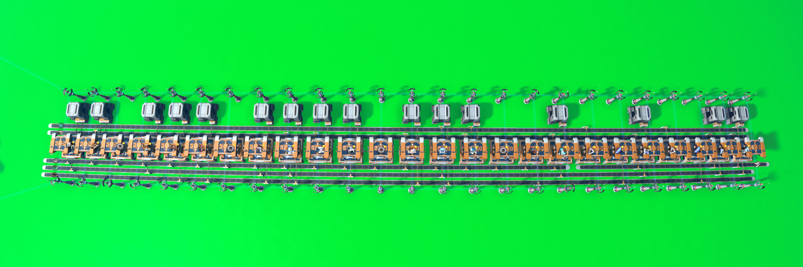
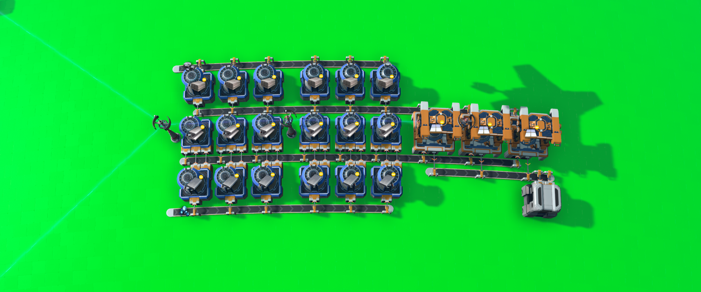

# dsp-blueprints
Blueprints for Dyson Sphere Program 🌌🌌🌌

# Stage 1

- This stage contains early game blueprints. All blueprints are capped at 600 entities.
- Power: Wind, Solar
- Fuel: Coal, Graphite
- Goals:
  - Get a basic hub working for common buildings (not advanced buildings).
  - Start producing foundations.
  - Get infra setup for all science (except white) and warpers.  
  - Transition to T3 belts/sorters/assemblers.
  - Automate logistic stations, drones, and vessels.

### Hub

The hub is split up into several parts all less than 150 entities. Inputs are iron ingots, circuits, coils, stone bricks, glass, and steel (on far right).

### Foundation

The foundation production is split into two parts, each less than 150 entities. Put down 3-5 of these and let them run to get a decent amount of foundation in the early game.

### Research

This is the basic infra that can support all science except white, and kick start warpers. The basic framework does not contain all towers, they need to be extended manually. This was done so that you don't run into height restrictions, and to keep the blueprints under 600 entities.

The initial placement looks like this:

After setting each tower to produce 1/s (3, 6, 8, 10, 12 high), the blueprint looks like this:

### Products

There are also blueprints for some intermediate products. This can be helpful to kick start logistic stations with some manual crafting. For example, the turbine blueprint is split into two parts each under 600 entities:

